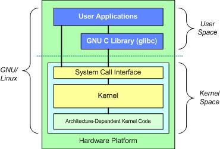

# Device Driver

A device driver is a special kind of `software program` that controls a `specific hardware device` attached to a computer.

## How does it work 

**User Space** (file under /dev for example) -> **Sys Call** (open, close, read, write) -> **Kernel Space** (driver) -> **Hardware** (device).

## Types of devices

1. **Character**: These devices transmit data character by character like a mouse or a keyboard. ex) Sensors, motors, LCDs, ..., etc.

2. **Block**: These devices are used to store data. ex) eeprom, hard disk, ..., etc.

3. **Network**: These devices used in networking. ex) WiFi, Bluetooth, ..., etc.

**Note**: On-board communication protocols as UART we can deal with it as a `Character device`.

## Types of driver

### Static in tree 

Loaded in `booting time`

### Module Dynamic

Loaded in in `User Space`.

## Loading Steps

1. ROM bootloader.

2. First Stage bootloader. (as MLO)

3. Second Stage Bootloade. (as U-boot)

4. Kernel Booting.

    The Kernel starts, and uses it's built-in drivers (`Static in tree`) and those are loaded by the loader to find the system disk(s), mount the root file system, and start /sbin/init.

5. Init process (`User Space`)

6. Kernel starts loading modules (`Module Dynamic`).

## Archeticture

- Device Driver codes are compiled by the kernel `Makefile` not the `User Space` compiler.

- Kernel by default doesn't see the GNU C Library

- That means we can't -for example- write `printf()` in `kernel space drivers`.

- But linux as a distro covers everything in GNU C Library by creating a version of it for the `Kernel Space`.

- So, instead of using -for example- `printf()`, we will use `printk()`.

- Therefore, we won't use anything from GNU C Library.

    

## Pseudo devices

- They are files usually located in `/dev`. They are like a device files, but instead of acting as a bridge between the `Operating System` and `Hardware`.

- They don't really exist as real devices.

## Kernel Headers

- Linux kernel headers are the essential files needed for compiling and linking programs that interface directly with the Linux kernel. They contain declarations of structures, constants, and functions that user-space programs can use to interact with the kernel. These headers define the interfaces that applications, device drivers, and other kernel modules use to communicate with the kernel.

- Having the kernel headers installed is especially important when compiling certain software packages, like device drivers or system-level utilities, as they often need to interact with the kernel directly. Without the appropriate headers, compiling such software would not be possible, or it might result in errors due to missing function declarations or constant definitions.

### Installing Kernel Headers

```bash
sudo apt get-update
sudo apt install linux-headers-$(uname -r)
```
### Locating installed Kernel Headers

- You can know your linux version through: 

```bash
uname -r
```

- You will find the installed headers according to your linux version:

```bash
# depends on your linux version
cd /usr/src/linux-headers-6.5.0-27-generic/include
```

- You will notice that the directories in this path are symlinked to directories in another path which is `linux-hwe-6.5-headers-6.5.0-27/include/`

```bash
# In /usr/src/linux-headers-6.5.0-27-generic/include
ls -lh
```
for example: `linux -> ../../linux-hwe-6.5-headers-6.5.0-27/include/linux`

- `include/linux`: This directory contains general-purpose kernel headers, including those related to core kernel functionality.

- `include/uapi/linux`: This directory contains headers defining user-space APIs, including those related to device drivers that user-space programs may interact with.

- Subdirectories corresponding to specific subsystems: For example, headers related to networking would be found in `include/net`, while headers related to block devices might be found in `include/block`.


